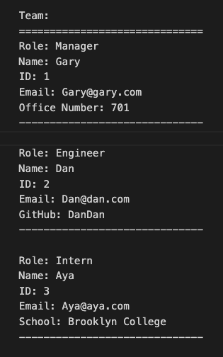

# Team Generator Application

This application prompts users for information about the team manager and then information about the team members. The user can input any number of team members and they will be a mix between Engineers and Interns. All team members created will then go into a text file stating their role, name, ID, email, an office number for Managers, a GitHub username for Engineers, and what school the Intern attends.

